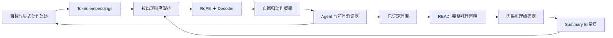

# PA+ v2

独立的 decoder-only 神经符号证明 Agent，复用 `formal/peano-pa-plus.mm` 的形式系统。开发要求及验收见 [开发目标](docs/development-plan.md)；引理递归编码的边界见 [研究与设计选择](docs/lemma-dependencies.md)。

主模型和引理编码器均为 causal Transformer，使用 RoPE、RMSNorm 与 SwiGLU。已证引理的声明被编码成一组连续向量，按 READ 发生的位置与 token embeddings 混排；首版不递归编码证明依赖。草稿纸和推理失败记录均为显式结构化文本。



默认主模型看见引理 ID/元数据和向量，完整声明只进入引理编码器与符号环境；SEARCH/READ 不重复提供文本声明供主模型绕过向量接口。审计日志仍保留全部公式。Python `context_segments(memory_mode="text"|"both")` 提供纯文本/混合消融路径。

预训练使用全生成文本的标准下一 token 预测；Agent SFT 只预测成功动作。RLVR 采样完整 Agent 轨迹，使用通过证明验证的终局奖励和组相对 clipped policy gradient。

所有命令从仓库根目录执行。已有 PyTorch 环境可在 PowerShell 中设置 `$env:PYTHONPATH='src;v2'`；正常安装入口为 `python -m pip install -e ".[neural,dev]"` 和 `pa-prover-v2`。以下命令默认 CPU，不会占用正在训练的 GPU；规模训练需显式选择 `--device cuda` 并自行设定预算。

```powershell
$env:PYTHONHASHSEED='0'
python -m pa_prover_v2 generate formal/peano-pa-plus.mm outputs/v2/corpus --seeds 7,11,19 --steps-per-seed 200 --max-examples 120 --library-items 32
python -m pa_prover_v2 audit formal/peano-pa-plus.mm outputs/v2/corpus --require-external
python -m pa_prover_v2 pretrain formal/peano-pa-plus.mm outputs/v2/corpus outputs/v2/ntp --d-model 128 --layers 4 --heads 4 --lemma-layers 2 --lemma-slots 2 --context 16384 --steps 100 --batch-size 1
python -m pa_prover_v2 sft formal/peano-pa-plus.mm outputs/v2/corpus outputs/v2/sft --checkpoint outputs/v2/ntp/model.pt --steps 100 --batch-size 1
python -m pa_prover_v2 rlvr formal/peano-pa-plus.mm outputs/v2/corpus outputs/v2/sft/model.pt outputs/v2/rlvr --groups 8 --group-size 4 --max-steps 24 --max-candidates 16 --require-external
python -m pa_prover_v2 evaluate formal/peano-pa-plus.mm outputs/v2/corpus outputs/v2/rlvr/model.pt outputs/v2/eval --library outputs/v2/rlvr/library.json --split test --limit 10 --samples 4 --neural-retrieval --require-external
```

`--require-external` 需要官方 Metamath 可执行文件；可以设置 `METAMATH_EXECUTABLE` 指向已安装路径。缺少或验证失败会拒绝正奖励/证明成功，不能将跳过等同通过。输出写入已忽略的 `outputs/`，模型和数据不提交 Git。

逐字节复现生成物时须在启动 Python **之前**固定 `PYTHONHASHSEED`，并保持 Python/PyTorch 版本、配置和源库不变；共享 v1 生成器的一些集合遍历会受 Python hash seed 影响。manifest 记录该值；只固定数学采样 seed 不保证证书 ID 和文件哈希一致。

## 数据与训练口径

`generate` 只使用 PA+ 源规则随机组合，导出证明 DAG，再展开为源标签证书并独立重放。划分同时绑定逻辑声明和证明骨架；辅助证明变量不应改变逻辑声明的分组身份。库只使用 train 组并排除当前目标；小规模随机 smoke 不保证每个划分非空，需增加样本/种子，而不能将 test 临时改为 train。

默认每个 seed 还生成至多 8 条随机的一步规则实例，作为 RLVR 起步课程：短的闭合源规则，配合有界的随机项和公式替换，全部经过同一内核验证。它们与组合 DAG 一起分组，不能按同一规则模板跨集合泄漏；不是手写数学题库。`--axiom-instances-per-seed 0` 可禁用。深证明的稀疏奖励仍需更多 SFT、课程安排和采样预算解决。

教师轨迹包含受控失败和回退，以及真实 `SAVE → READ → USE`。如已有训练库引理的实例能够证明一个中间目标且前提满足，则用 `SEARCH → READ → USE` 替换原 APPLY。统计区分草稿复用、全局库复用及候选检查次数；没有成功匹配不能统计为库复用。

- **NTP**：完整按时间排列的轨迹做下一 token CE，包括环境反馈和失败文本。固定长度分块通常重叠一个 token；MEM 边界可能重叠完整槽块，但每个正文目标只预测一次。MEM 位置保持完整，控制槽不计 CE。
- **SFT**：重放相同环境，在当前前缀上预测成功动作；错误动作自身不作为正监督，但错误与反馈保留在后续上下文。超出模型完整上下文或引理长度的样本明确过滤并计数。
- **RLVR**：同目标采样一组实际 Agent 轨迹，经过目标声明一致性与证明重放后才给终局奖励 1；其余为 0。PPO/GRPO 风格的组相对 clipped policy gradient，加固定参考策略 KL。无奖励差异的组不会虚构梯度，报告 `zero_group_advantage`。损失对全部动作平均，长轨迹因而具有更高总权重；这不是逐轨迹等权的 GRPO。

RLVR 使用有限候选动作策略。每个候选的分数来自自回归 token log-probability，默认除以动作长度后 softmax，并混合 10% 均匀探索；这个确定的 categorical 分布用于采样、old log-prob 和更新。Python `PolicyConfig(length_penalty=0)` 可改用整条动作的 log-prob 总和评分，仍应用温度和探索混合；这些参数与候选集在同一轮更新中保持一致。

RLVR 每组之后按真实成功 USE 次数更新重要性，并将新认证的 train 证明加入预算库；不接收测试样本。默认 RLVR 采用词法检索，避免训练过程中索引变化干扰采样。评估的 `--neural-retrieval` 从当前 checkpoint 创建冻结引理编码器快照与向量索引；Python `FrozenLemmaRetriever.refresh(model)` 可在训练轮次边界显式刷新。用于主模型输入的引理向量始终由当前权重重算并反传，和检索索引的冻结向量不同。

神经检索把一条声明的 summary slots 取均值后计算余弦相似度。目前没有单独的检索对比损失；编码器通过后续 token 预测学习。检索质量是否优于词法检索必须另做消融，不能由索引可运行推断。

## 产物、限制与可复现性

- `corpus/manifest.json`：理论哈希、seed、划分规则、文件哈希、动作/复用覆盖与过滤原因。
- `*/metrics.jsonl`、`*/summary.json`：loss、梯度、采样/认证计数、过滤与零优势组。
- `model.pt`：架构与 tokenizer 严格契约、权重与理论指纹。v1 checkpoint 不兼容。`--checkpoint` 初始化下一训练阶段，优化器重新创建；不是精确中断恢复。
- `library.json`：完整符号声明、证书、出处、数量/字节预算和可选索引身份。
- `eval/rollouts.jsonl` 与 `*.mm`：显式动作观察与成功证书。搜索耗尽表示 unknown，不表示目标为假。

前向工作区用已有事实和目标匹配生成有限候选，不枚举全部可能证明，也不保证完备。首版没有 KV cache、长上下文轨迹分页、自动停止循环深度或多 GPU 训练；这些是性能/规模后续工作，不影响独立证书验证。当前配置是可运行基线，尚未通过大规模超参数搜索证实最优。不要将少量 CPU 更新的 loss 下降或 smoke 认证计数当作数学能力提升。

实际验收结果见 [验证记录](docs/validation.md)。
